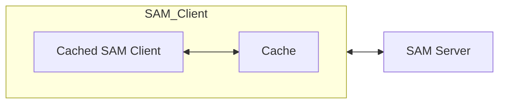

# Cached OSAM

This repository implements a "cache" abstraction on top of SAM, that we call Cached SAM. The client interface of Cached SAM involves two types: `CacheObj` and `CachePtr`. Using these types and their methods, clients can write SAM programs that are intuitive, guaranteed to be legal with respect to the SAM properties (never read/write an address more than once), and efficient. Efficiency is achieved because Cached SAM provides a kind of move semantics that avoids unnecessary copies of data blocks or pointers. Importantly, Cached SAM also completely abstracts away the underlying SAM/pointer semantics from the user. We describe the components in more detail below:

## High-level structure



The above figure shows the high-level structure of Cached OSAM. In addition to a client (Cached SAM Client) and server, we also have a Cache. Note that the Cache is "trusted" (in fact, it is implemented completely locally on the SAM Client). The composition of the Cached OSAM Cliemt together with the Cache forms a legal SAM client. 

## Data block model

We assume that our data blocks to be stored on the SAM server consist of an array of data items, along with an array of pointers. These pointers are "raw" SAM pointers (that point to a leaf of a splay tree, allowing multiple pointers to an object). That is, the data block structure is logically the following:

```
struct data_block
  data[m]
  ptrs[n]
```

In the actual C++/Python implementations (described further below), this is just an array of integers, with the first few integers being data and the rest pointers. 

## Cache semantics, CachePtr and CacheObj

Cached SAM is built on top of SAM and the "raw" SAM pointers (that support multiples pointers to a single block using splay trees). Specifically, the SAM server stores invetrted splay trees with data objects at their root, to support multiple pointers pointing to the same location, in the same way as in the SAM pointer interface. 

The Cache is a map from SAM addreses `a` to tuples `(b, rc)` where b is a data block and `rc` is a refcount. We will explain the use of the refcount below. 

Cached SAM has two key properties

1. There is always at most one copy of any data block anywhere in the system (Cached SAM Client's local memory + Cache + SAM server)

2. The client can never directly interact with SAM addresses, or even directly manipulate data blocks or raw SAM pointers. All such accesses/manipulations are done through the `CacheObj`/`CachePtr` interface. 

We begin by explaining how we enforce the first property dueing a deference of a raw SAM pointer, first between the Cache and Server only (between cache and server,  there is at most one copy of any object), pretending for now that we don't have any `CacheObj`/`CachePtr`. Note that in reality, due to Propety 2 above, this dereference wouldn't be performed by the client directly, but rather triggered indirectly through some operation on a `CachePtr/CacheObj`. 

- Suppose we need to dereference a raw SAM pointer `p` (that points to some leaf in a splay tree) and the pointed-to data block resides on the server (so not on cache, assuming the invariant holds before the operation). We traverse the splay tree until we reach the root node `b`, at SAM address `a`. 

- In the ordinary SAM smart pointer world,  we would return a smart copy of `b` to the client, allocate a new address `a'` to write `b` back to, and and write `b` back, along with necessary updates to the rest of the splay tree to point to this new root location.  

- In Cached SAM, we allocate the new write-back address `a'`, update the splay tree *except the root* to be consistent with this address `a'` (i.e. the root's children point to `a'`), but we do not write the data block back to `a'`.

- Instead, we insert a mapping `a' -> b` into the cache (we ignore the refcount for now). 

- The client can now access the data block in the cache. 

- On a subsequent pointer dereference targeting the same data block, we will check at the penultimate step in the splay tree walk, just before we reach the root, whether the target address is in cache. If so, we will abort the walk and directly return data from the cache (note that in the actual implementation we actually have to check at every level of the walk, since we don't know where the root is).

- Later, if we need to evict the block from the cache, we can just write it to `a'` (since the server-side tree always remains consistent with the block actually being at `a'`, the server-side storage is still in a legal state). 

Now to actually enforce property 1 in full (not even the Cached SAM client's local memory can hold a copy of an object), the Cached SAM client must never get a hold of an actual data object. We use `CachePtr` and `CacheObj` to enforce this. A `CacheObj` is logically a *reference* to a data block in cache (in the implementation, the `CacheObj` just wraps a writeback address since the cache is keyed by writeback addresses which remain constant as long as a block is in cache). The dereference operation described above can then return a `CacheObj` referring to the block in cache after it has inserted/found it there. Similarly, a `CachePtr` represents a reference to some pointer in a data block. 

The key invariant for `CachePtr`/`CacheObj` is that as long as the Cached SAM client holds a `CachePtr`/`CacheObj` referencing a certain block in its local memory, that block resides in the cache. So it is only safe to evict when the client has dropped all references to a block. 

`CacheObj` and `CachePtr` also allow us to maintain Property 2: in particular a client can only manipulate data blocks through the methods of `CacheObj`/`CachePtr`. 

Some important methods on `CacheObj` are `at(idx)`, which returns a data value in the block at a particular index (recall the data block model) and `ptr_at(idx)`, which returns a `CachePtr` referencing a pointer in the block. See the implementation for the full details.  

Important methods on `CachePtr` are `deref()` and `set(CachePtr p')` (again, see the implementation for the full details). `deref()` returns a `CacheObj` referencing the data block pointed to by the `CachePtr` (`deref()` essentially performs the dereference operation described above). `set(CachePtr p')` sets the value of the cache pointer to a *copy* of a pointer referenced by `p'`, in addition to destroying the currently referenced pointer if any. Note that internally, the value of the raw SAM pointer must *change* on a deference (also, the value of a pointer must change if we copy it to produce another pointer), however this is completely abstracted away by the cache interface. This is one example of how the cache interface makes programming simpler by hiding details of SAM/pointer operations. 

The client can freely copy `CachePtr`/`CacheObj` instances themselves; we use reference counting to ensure that the cache only evicts a block when no `CachePtr`/`CacheObj` are referencing it. 

### Creating CacheObj and the root object

We can allocate new SAM data blocks by creating `CacheObj` using the default constructor (see `test_cacheptr`) in `main.cc`. Calling the default constructor multiple times creates multiple objects. 

A quirk of the Cached OSAM design is that, since we can only dereference/set/destroy/allocate pointers already contained in data blocks, we need a top-level root `CacheObj` from where we can reach other `CacheObj`. The root `CacheObj` should always be in the cache. 

## Implementation

The code provides C++ and Python implementations of the Cached SAM interface. Both are essentially equivalent, but I think the C++ implementation is more straightforward due to built-in support for RAII, so I would suggest only looking at the Python implementation if really necessary. 

### C++ Implementation

- The provided Makefile can be used to compile the C++ implementation

- The CacheObj/CachePtr classes are defined in `sam.cc` and `sam.h`. 

- `main.cc` implements a graph random walk benchmark using `CacheObj/CachePtr`. The important function in this process is `get_leaf_cache` in `tree.cc`, which walks down a tree to get a certain leaf using `CachePtr/CacheObj` operations. 

- `CachePtr` and `CacheObj` are implemented using reference counting and RAII. This ensures that when all `CachePtr`/`CacheObj` that reference some block in the cache go out of scope or are deleted, the block is evicted (and it is not evicted before this happens)

### Python implementation

- The Python implementation is mostly a direct translation of the C++ implementation, with a couple of "hacks" to support the lack of references and RAII

- Running `main.py` will perform the same random graph walk benchmark as the C++ implementation. This should give almost exactly the same reads/writes/allocs counts as the `C++` version, with any minor difference most probably due to the point below. 

- Since Python does not have RAII, we call the destructors of `CacheObj`/`CachePtr` (which decrement the refcount and evict from cache if it hits 0) in the `__del__` function of each class, which is triggered when the object is garbage collected. Unfortunately due to the way the garbage collector works, we cannot make many guarantees about when this happens. 


