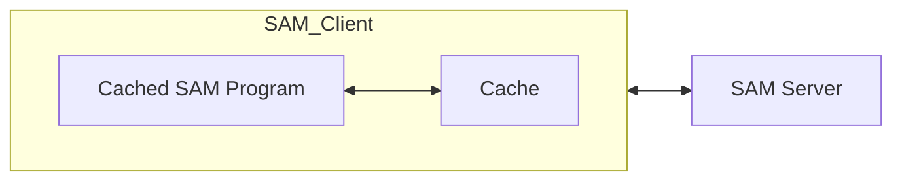

# OSAM Cache

This repository implements a "cache" abstraction on top of SAM and "raw" smart pointers, that we call Cached SAM. The client interface of Cached SAM involves two types: `CacheObj` and `CachePtr`. Using these types, clients can write SAM programs that are intuitive, guaranteed to be legal with respect to the SAM properties (never read/write an address more than once), and efficient. Importantly, this completely abstracts away the underlying SAM and smart pointer semantics from the user. Cached SAM also provides a kind of move semantics that avoids unnecessary copies of data blocks or pointers. We describe the components in more detail below:

## High-level structure



The above figure shows the high-level structure of Cached OSAM. In addition to a client (Cached SAM Program) and server, we also have a Cache. Note that the Cache is "trusted" (in fact, it is implemented completely locally on the client). The composition of the Cached OSAM program with the cache forms a legal SAM client. 

## Data block model

We assume that our data blocks in the SAM server consist of an array of data items, along with an array of pointers. That is, the data block struct is logically the following:

```
struct block
  data[m]
  ptrs[n]
```

In the actual implementation, this is just an array of integers, with the first few being data and the rest pointers. 

## Cache semantics, CachePtr and CacheObj

Cached SAM is built on top of the SAM smart pointer interface. The SAM server stores invetrted splay trees with data objects at their root, to support multiple pointers pointing to the same location, in the same way as the smart pointer interface. 

The cache is a map from SAM addreses `a` to tuple `(b, rc)` where b is a data block and `rc` is a refcount. We will explain the use of the refcount below. 

Cached SAM has two key properties

- There is always at most one copy of every data block anywhere in the system (Cached SAM client + Cache + SAM server)

- The client can never directly interact with SAM addresses, or even directly manipulate data blocks. All such accesses/manipulations are done through the `CacheObj`/`CachePtr` interface. 

We begin by explaining how we enforce the part of the first property that says that between cache and server,  there is at most one copy of the object, pretending for now that we don't have any `CacheObj`/`CachePtr`. 

- Suppose we need to dereference a pointer p. We traverse the splay tree until we reach the root node `b`, at SAM address `a`. 

- Ordinarily, we would return a smart copy of `b` to the client, allocate a new address `a` to write `b` back to, and and write `b` back, along with necessary updates to the rest of the splay tree to point to this new root.  

- With the cache, we allocate the new write-back address `a'`, update the splay tree *except the root* to be consistent with this address `a'` (i.e. the root's children point to `a'`), but we do not write the data block back to `a'`.

- Instead, we insert a mapping `a' -> b` into the cache (we ignore the refcount for now). 

- The client can now access the data block in the cache. 

- On a subsequent pointer dereference targeting the same data block, we will check at the penultimate step in the splay tree walk, just before we reach the root, whether the target address is in cache. If so, we will abort the walk and directly return data from the cache (note that in the actual implementation we actually have to check at every level of the walk, since we don't know where the root is).

- Later, if we need to evict the block from the cache, we can just write it to `a'` (since the server-side tree always remains consistent with the block actually being at `a'`). 

Now note that to actually enforce property `1` in full, the Cached SAM client must never get a hold of an actual data object. We use `CachePtr` and `CacheObj` to enforce this. A `CacheObj` is logically a *reference* to a data block in cache (in the implementation, the `CacheObj` just wraps a writeback address since the cache is keyed by writeback addresses which remain constant as long as a block is in cache); the deref operation above can then return a `CacheObj` referring to the block in cache after it has inserted/found it there. A `CachePtr` represents a reference to some pointer in a data block. 

The key invariant for `CachePtr`/`CacheObj` is that as long as the Cached SAM client has a `CachePtr`/`CacheObj` referencing a certain block, that block resides in the cache. So it is only safe to evict when the client has dropped all references to a block. 


`CacheObj` and `CachePtr` also allow us to maintain the second property: a client can only manipulate data blocks through the methods of `CacheObj`/`CachePtr`. 

Some important methods on `CacheObj` are `at(idx)`, which returns a data value in the block at a particular index (recall the data block model) and `ptr_at(idx)`, which returns a `CachePtr` referencing a pointer in the block. 

Important methods on `CachePtr` are `deref()`, which returns a `CacheObj` referencing the data block pointed to by the `CachePtr` and `set(CachePtr p')`, sets the value of the cache pointer to a *copy* of a pointer referenced by `p'`, in addition to destroying the currently referenced pointer if any. Note that internally, the value of the raw SAM smart pointer must *change* on a deference, however this is completely abstracted away by the cache interface. This is one example of how the cache interface makes programming simpler. 


